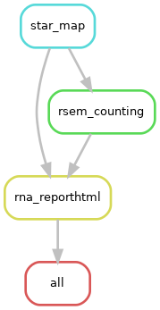

# Generic Pipeline for RNA-seq analysis using STAR/RSEM/BioC/DESeq2

Currently two conditions are supported. Including QC metrics, differential
genes calling, gene set enrichment analysis and KEGG analysis.

## Visualization of the workflow



## Step1: creating conda environment *da*
Using environment.yml file, which includes the packages needed, to create a conda environment, named *da* (e.g., data analysis).
And install some other required packages, seperately. e.g., DO.db

```
conda env create -f environment.yml 
```

```
conda activate da
conda install -c bioconda bioconductor-do.db 
conda install -c conda-forge r-readr
```

## Step2: modify the config.ymal
Modify the configuration file, e.g., output folder prefix: *outprefix*; condition names: *sample1* and *sample2*; species: *mm* or *hs*


## Step3: activate environment *da* and run snakemake workflow

```
snakemake -np # dry run
snakemake --cores 16  # you may use slurm to submit this command

```
